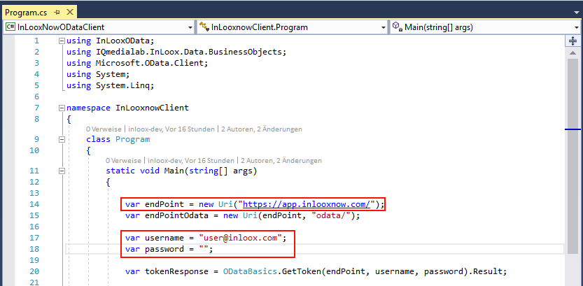
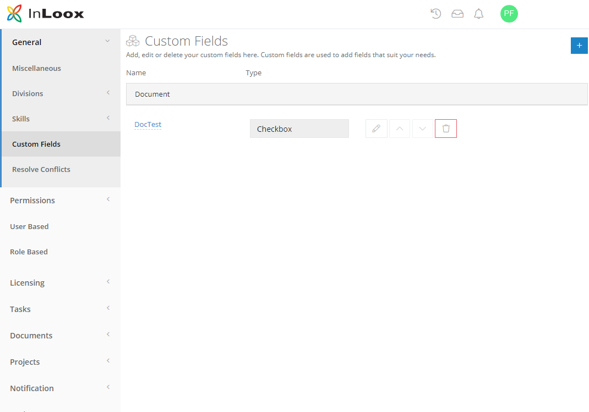
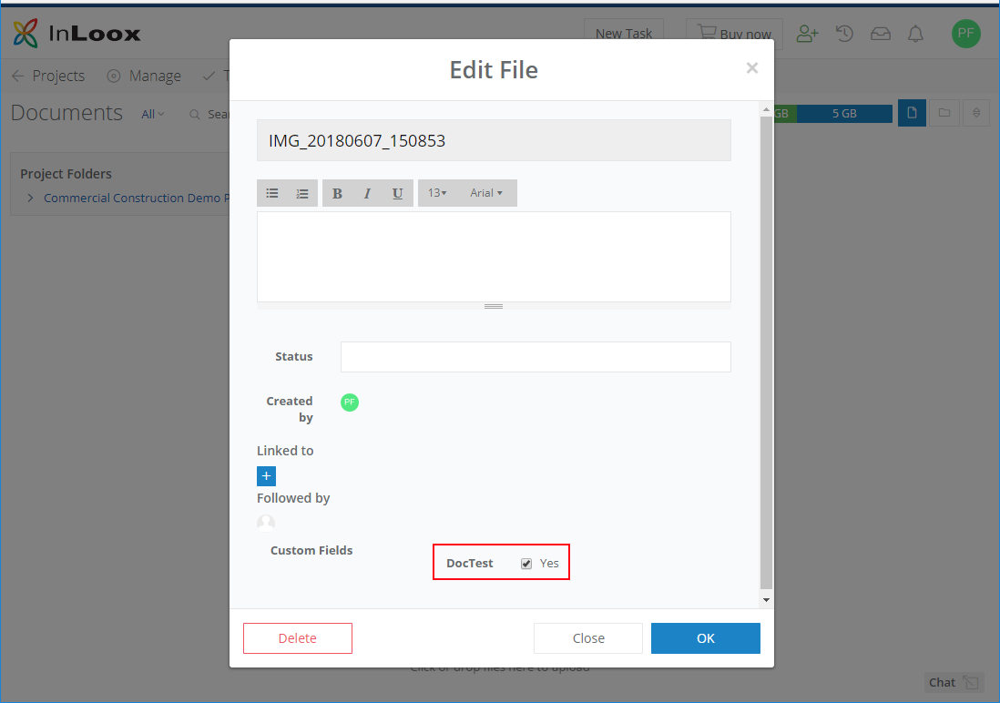
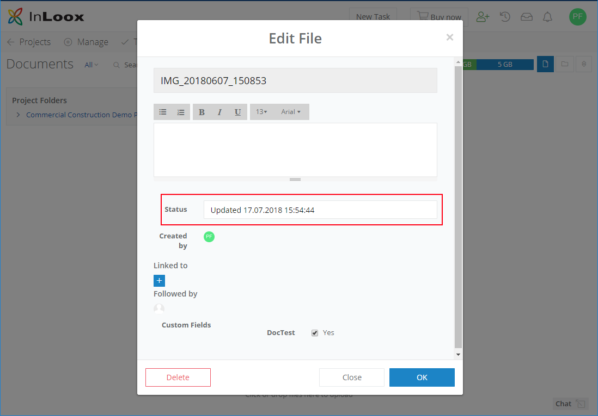

# InLoox OData Api Example for Version 10

a collection of code examples to work with InLoox.ODataClient nuget package https://www.nuget.org/packages/InLoox.ODataClient/

Start coding: 

## Setup
1. Enter your credentials [username/password](https://github.com/inloox-dev/inloox-api-client/blob/2ca69ca8110d32fbe05d9a1a15fc81613512331b/InLooxNowODataClient/Program.cs#L17).
Please note, this is an example and you shouldn't save your credentials in clear text. Better use environment variables / config files.
2. Update endpoint to InLoox [endPoint](https://github.com/inloox-dev/inloox-api-client/blob/2ca69ca8110d32fbe05d9a1a15fc81613512331b/InLooxNowODataClient/Program.cs#L14).
For InLoox now use https://app.inlooxnow.de or https://app.inlooxnow.com
for InLoox Enterprise Version (Saas) use your iis url

## Example 1

### Description
The example loads the first 10 documents from https://app.inlooxnow.com with custom field 'DocTest' set to true and updates the status field.

The following custom field is required to run:  
Name: DocTest
Place: Document
Type: Checkbox

### Setup Example 1
First, create a custom field named DocTest under options->General->Custom Fields
https://app.inlooxnow.com/options/#/options/customfields

Second, open up a project and go to the document section. Upload a new file or open an exisiting one.
The custom fields section of the file dialog shows the new field to check.

Now, run the InLooxNowOdataClient example. After a few seconds the checked documents should show an updated status entry

## Example 2
### Description
Creates a task with description and updates the name

## Example 3
### Description
Creates a user and adds an authentication entry
